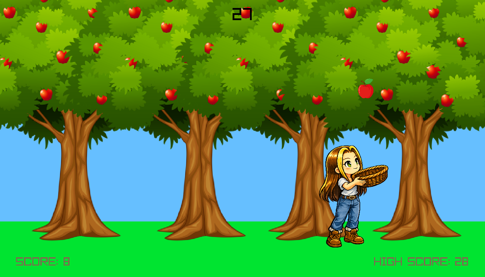
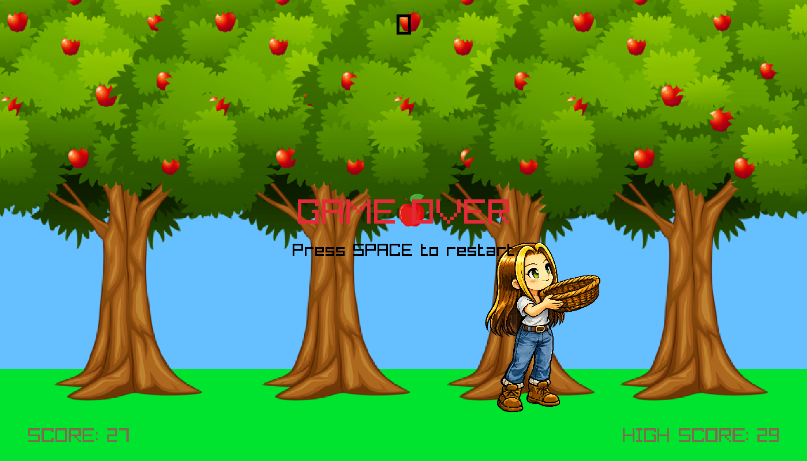

# Apple Catcher

Thanks for checking out Apples!

A small arcade-style game made with C++ and raylib where you catch falling apples before time runs out.

---

## Features

- Falling apples
- Red apples (+1 score)
- Green apples (+2 score)
- Rotten apples (-1 score)
- Score tracking
- High score saving
- Timer system
- Background music and sound effects
- Restart functionality
- Player movement and collision detection

---

## Screenshots

---

## Controls

| Key | Action |
|---|---|
| Left Arrow | Move Left |
| Right Arrow | Move Right |
| ESC | Quit |

---

## Download and Run

### Linux

Make sure `g++` and `raylib` are installed.

-Bash: g++ main.cpp game.cpp apple.cpp player.cpp tree.cpp -o apples -lraylib
-Run: ./apples

### Windows

Install:
- MinGW-w64 or MSYS2
- raylib
- Download the full project from this repository

Compile:

-Bash: g++ main.cpp game.cpp apple.cpp player.cpp tree.cpp -o apples.exe -lraylib

-Run: ./apples.exe

### macOS
Install:
- Xcode Command Line Tools
- Homebrew
- raylib

Install raylib:

-Bash: brew install raylib

Compile:

-Bash: g++ main.cpp game.cpp apple.cpp player.cpp tree.cpp -o apples -lraylib

-Run: ./apples
